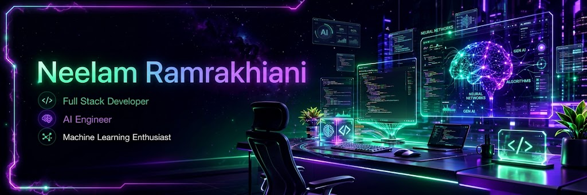
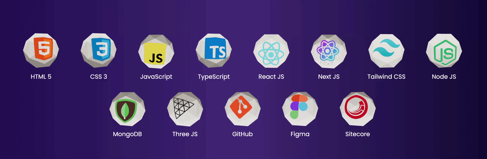

<p align="center">
  
</p>

<h2 align="center">
  
</h2>

<h1 align="center">
Hi 👋 I'm <b>Neelam Ramrakhiani</b>
</h1>

<h3 align="center">
💻 Full Stack Developer • 🤖 AI Engineer • 🚀 AI & Machine Learning Developer
</h3>

<p align="center">
Building intelligent web applications and AI-powered solutions with modern technologies,
clean architecture, and exceptional user experiences.
</p>

---

# 🚀 About Me

<p align="center">
<i>
Transforming ideas into intelligent software through clean code, creativity, and AI innovation.
</i>
</p>

<table>
<tr>

<td width="65%">

```yaml
👩 Name: Neelam Ramrakhiani
💼 Role: Full Stack Developer & AI Engineer
📍 Based In: India
🎓 Degree: Master's in Computer Application (MCA)
📧 Email: neelam.projects@gmail.com
```
🚀 Specialization: AI • Full Stack • Machine Learning
💻 Current Focus: Frontend AI Engineering Internship
🎯 Mission: Creating impactful AI-powered digital experiences


- 🚀 Building scalable and modern web applications.
- 🤖 Developing AI-powered solutions with practical impact.
- 📚 Continuously learning emerging technologies.
- 💡 Passionate about clean code, UI/UX, and problem solving.
- 🌍 Open to collaboration on innovative software projects.
- 📬 Reach me: **neelam.projects@gmail.com**

</td>

<td width="35%" align="center">


</td>

</tr>
</table>

---
# 💻 Tech Stack

<p align="center">



</p>

<p align="center">
<i>Building modern web applications with AI-powered technologies.</i>
</p>

<!-- --- -->

<!-- # 📈 1. Contribution Graph

<p align="center">


</p> -->

<!-- --- -->

<!-- # 🚀 2. Featured Projects

<table>
<tr>

<td width="50%">

### 🐾 Pet Hub

Modern Pet Adoption & Care Platform

**Tech**
- HTML
- CSS
- JavaScript

</td>

<td width="50%">

### 🌐 Personal Portfolio

Modern Animated Portfolio Website

**Tech**
- React
- Tailwind CSS
- Netlify

</td>

</tr>

<tr>

<td width="50%">

### 🤖 AI Projects

Machine Learning & AI Applications

**Tech**
- Python
- TensorFlow
- OpenCV

</td>

<td width="50%">

### 💼 FlyRank Internship

Frontend AI Engineering Tasks

**Focus**
- Git
- GitHub
- Documentation
- AI Workflow

</td>

</tr>

</table>

---

# 💬 3. Favorite Quote

<p align="center">

> **"The best way to predict the future is to build it."**

</p> -->

<!-- --- -->

<p align="center">

⭐ Thanks for visiting my profile ⭐

</p>

<p align="center">

Made with ❤️ by **Neelam Ramrakhiani**

</p>

---

## 🔥 GitHub Streak

<p align="center">
  
</p>

<p align="center">
<i>Consistency is the key to becoming a better developer.</i>
</p>

---

<h2 align="center">🌐 Connect With Me</h2>

<table align="center" width="100%">
<tr>
<td width="33%" align="center">
<a href="https://www.linkedin.com/in/neelam-r/" target="_blank">

</a>
</td>
<td width="33%" align="center">
<a href="mailto:neelam.projects@gmail.com">

</a>
</td>
<td width="33%" align="center">
<a href="https://github.com/neelamchawla">

</a>
</td>
</tr>
</table>

---


